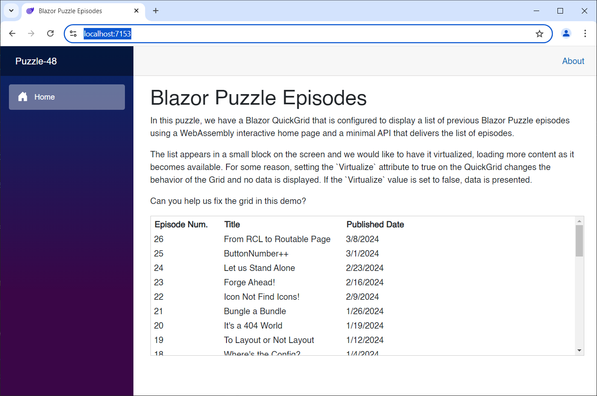

# Blazor Puzzle #48

## Virtually Nothing

YouTube Video: https://youtu.be/9SM-48PVEQM

Blazor Puzzle Home Page: https://blazorpuzzle.com

### The Challenge:

In this puzzle, we have a Blazor QuickGrid that is configured to display a list of previous Blazor Puzzle episodes using a WebAssembly interactive home page and a minimal API that delivers the list of episodes.

The list appears in a small block on the screen and we would like to have it virtualized, loading more content as it becomes available.  For some reason, setting the `Virtualize` attribute to true on the QuickGrid changes the behavior of the Grid and no data is displayed.  If the `Virtualize` value is set to false, data is presented.

Can you help us fix the grid in this demo?

### The Solution

Of course, we have to turn QuickGrid virtualization on:

```xml
<QuickGrid ItemsProvider="@EpisodeProvider" Virtualize="true">
```

More importantly, though, when returning the `GridItemsProviderResult`, we need to include the `TotalItemCount` property:

```c#
return new GridItemsProviderResult<Episode>()
{
    Items = episodes?.Skip(req.StartIndex).Take(req.Count ?? int.MaxValue).ToArray() ?? Array.Empty<Episode>(),
    TotalItemCount = episodes?.Count() ?? 0
};
```



Boom!